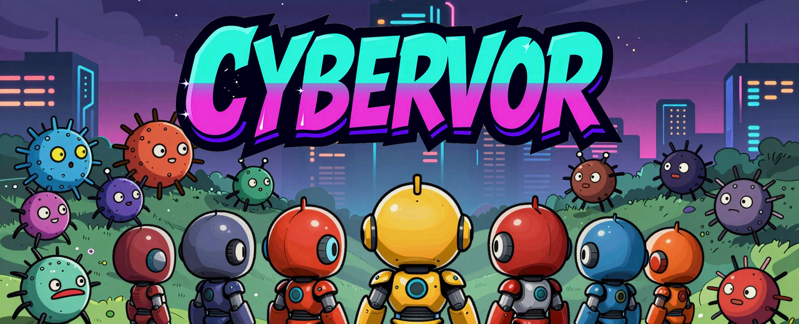
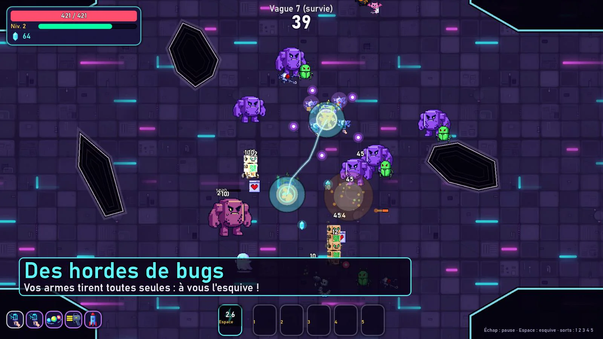
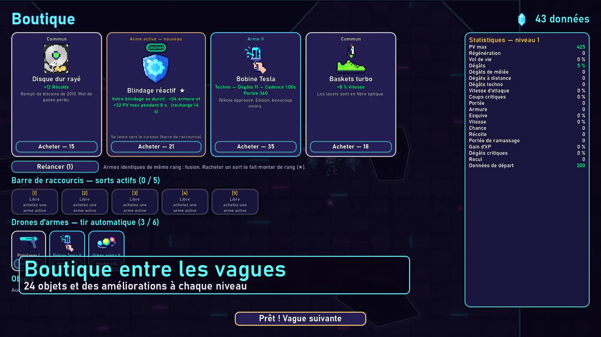
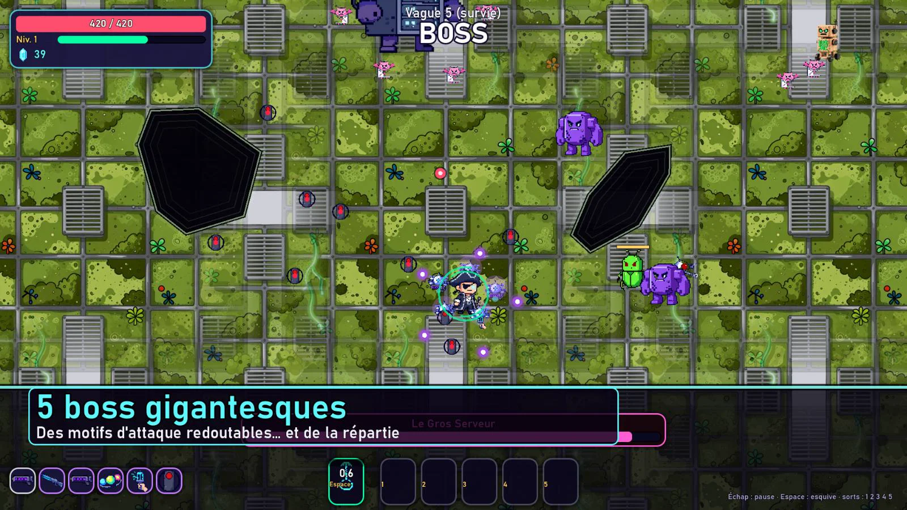
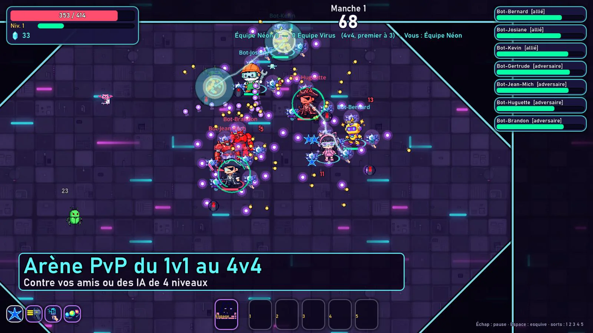
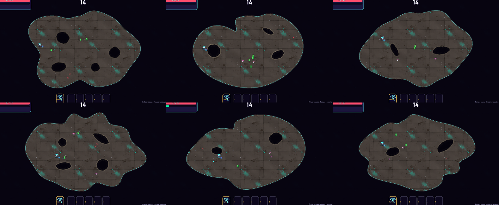
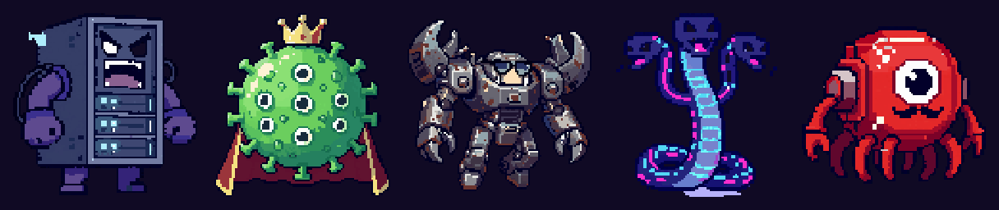
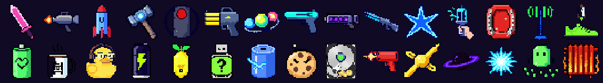

<p align="center"></p>

# Cybervor

Survivor d'arène en **pixel art 16 bits cyberpunk** : vous bougez, vos armes visent et tirent toutes seules,
et entre les vagues la boutique vous transforme en machine de guerre. Coop jusqu'à 4 joueurs, campagne
humoristique, arène PvP du 1v1 au 4v4, arbres de compétences et battle pass. Le jeu est entièrement en français.

- Moteur : **Godot 4.7.1** (GDScript, multijoueur ENet autoritaire serveur)
- Visuels, musiques et effets sonores : **générés en local avec ComfyUI** (voir [`tools/comfy`](tools/comfy))
- Serveur : API méta **FastAPI** + salons de jeu dédiés sous **Docker** (voir [`server/`](server))
- Site et téléchargement : https://vps-3962b7dc.vps.ovh.net/cybervore/

<p align="center">
  
  
</p>
<p align="center">
  
  
</p>

## Héros

<p align="center"></p>

Kernel, Volta, Brutus, Glitchette, Mécano et Capitaine Néon : chacun a ses statistiques, son arme de départ,
son esquive et son arbre de sorts. Quatre se débloquent au fil de la campagne.

## Arènes organiques

<p align="center"></p>

Chaque partie génère une arène différente à partir de sa graine (identique sur le serveur et chez tous les
clients) : côtes découpées, lobes, baies, presqu'îles, et des failles dans le sol à contourner. Les projectiles
passent au-dessus du vide ; les ennemis suivent un champ de navigation pour contourner les obstacles. Un test
automatique (`--maptest`) vérifie sur 240 cartes que tout reste accessible, même pour un boss.

## Boss, armes et objets

<p align="center"></p>
<p align="center"></p>

## Contenu

| Fonctionnalité | Détails |
|---|---|
| Héros | 6 personnages avec capacités, esquives et armes de départ ; 4 se débloquent via la campagne |
| Combat | 12 armes en 4 rangs (projectiles, roquettes, mêlée, éclairs en chaîne, orbes, lance-flammes, railgun, mines…), fusion d'armes, 24 objets, ~35 statistiques |
| Sorts | Armes actives achetées en boutique : sorts à lancer vers le curseur (lasers, frappes orbitales, zones…), barre de 5 raccourcis configurable (clavier, souris, manette) |
| Ennemis | 11 ennemis aux IA variées, élites, 5 boss à motifs d'attaque |
| Campagne | 5 zones × 4 missions, dialogues humoristiques (Mamie RAM, le Noyau et sa moustache) |
| Modes | Campagne (solo / coop), survie infinie, arène PvP en équipes du 1v1 au 4v4 contre des humains et/ou des IA |
| Multijoueur | Salons créés par les joueurs (coop ou PvP), parties ouvertes, LAN, serveurs dédiés |
| Progression | Niveau de compte, 5 arbres de compétences, battle pass « Surtension » (40 paliers), sauvegarde cloud avec resynchronisation hors ligne |
| Mises à jour | Mise à jour automatique au lancement, proposée en cours de jeu sans interrompre les parties |
| Social | Amis, messagerie, chat d'équipe, rapports de bugs et suggestions intégrés |

## Arborescence

```
data/            définitions du jeu (JSON) : héros, armes, objets, sorts, ennemis, campagne, battle pass, notes de version
assets/          sprites (pixel art), fonds, textures, musiques et effets sonores
scripts/
  autoload/      Db, Settings, Audio, Profile, Backend, Net, Game, Ui, Updater
  ui/            écrans (menu, campagne, salons, compétences, battle pass, paramètres, résultats…)
  world/         arène : monde, carte (ArenaMap), joueurs, ennemis, projectiles, sorts, combat, HUD, boutique
server/          API méta (FastAPI), superviseur de salons, Docker, déploiement
tools/comfy/     workflows ComfyUI + générateur d'assets (style 16 bits : pixel_snap.py)
tools/release/   publication d'une version (export, archive, manifeste) et déploiement
tools/trailer/   enregistrement et montage de la bande-annonce
website/         site de présentation
docs/images/     images de ce README
```

## Lancer / exporter

- Éditeur : ouvrir le dossier avec Godot 4.7.1.
- Nouvelle version : `python tools/release/make_release.py X.Y.Z` (exports Windows + serveur Linux, archive, manifeste).
- Serveur dédié : `Cybervor.exe --headless -- --server --port 7777 --mode coop --max 4` (ou build Linux, voir `server/README.md`).

## Outils de test intégrés

```
godot --headless --path . -- --check                        # compile tous les scripts
godot --headless --path . -- --maptest                      # arènes : accessibilité et contournement
godot --headless --path . -- --autotest --mission z1_m4     # partie complète pilotée par l'IA
godot --headless --path . -- --autotest --pvp --teams 4 --ai 3    # PvP 4v4 contre des IA
godot --path . -- --spelltest                               # sorts visés, laser, frappe orbitale
godot --path . -- --preview main_menu,shop,game --out captures/   # captures d'écran
cd server/meta-api && python -m pytest                       # API méta
```

## Commandes

ZQSD / WASD / flèches / stick gauche : se déplacer — Espace : esquive — 1 à 5 : sorts (vers le curseur) —
Échap : pause — Entrée : chat — F1 : signaler un bug — F2 : amis et messages.
Toutes les touches des sorts se règlent dans Paramètres › Commandes (souris et manette comprises).

## Licences

Code et contenus du jeu : © les auteurs de Cybervor, tous droits réservés.
